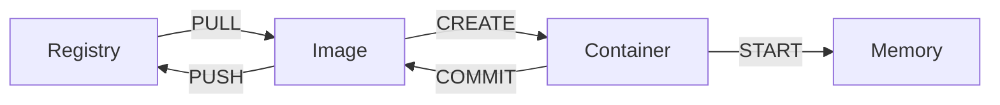

뛰어난 가상환경을 제공해주면서 마이크로서비스를 제공할 수 있는 다양한 기능들을 제공하고 있어 많이 사용되며 다양한 클라우드 서비스 모델과 같이 사용되고 있다. 

## 도커 구성요소 
- 이미지 : 필요한 프로그램과 라이브러리, 소스를 설치한 뒤 만든 하나의 파일.   
- 컨테이너 : 이미지를 격리하여 독립된 공간에서 실행한 가상환경.   

> 컨테이너를 격리하는 기술. 
 1. 리눅스 네임 스페이스. 
  각 프로세스가 파일 시스템 마운트, 네트워크, 유저(uid), 호스트 네임(uts) 등에 대해 시스템에 독립 뷰를 제공  
 2. 리눅스 컨트롤 그룹. 
  프로세스로 소비할 수 있는 리소스양(CPU, 메모리, I/O, 네트워크 대역대, device 노드 등)을 제한  

- 레지스트리 : 보관소. 이미지를 다운 받을수 있음.
도커 레지스트리에는 사용자가 사용할 수 있도록 데이터베이스를 통해 image를 제공해 주고 있음. 누구나 이미지를 만들어 푸시할 수 있으며 푸시된 이미지는 다른 살마들에게 공유 가능 


<br/>
## 도커 라이프 사이클 이해하기

* RUN : CREATE + START   


<br/>
## 도커 사용하기
### 이미지 다운로드 받는 방법
#### 도커 검색
 ```sql
 sudo docker search tomcat
 ```

#### 도커 이미지 다운로드
 ```sql
 docker pull mysql(이미지 이름)
 ```

#### 로컬 시스템에 있는 도커 이미지 확인
 ```
 docker images	
 ```
 다운 받은 이미지를 확인 할 수 있음  
 -q : 이름만 확인

### 도커 이미지 정보 확인
```sql
sudo docker inspect <>
```

<br/>
### 컨테이너 생성  
```sql
sudo docker run -d --name tc tomcat
```
-d : background에서 돌림  
--name : container 이름 지정 


### 실행중인 컨테이너 확인. 
```sql
sudo docker ps   
```
-a : 전부  
rm :컨테이너 삭제     


### 컨테이너 삭제
```sql
sudo docker rm <ID>
```


<br/>
## 도커 정보 확인하기

### 도커 이미지 저장소 확인
docker info : 도커 이미지 저장소 위치 확인  
docker/imagedb

### 컨테이너에 대한 정보를 가지고 만들어주는 폴더  
docker/layerdb : docer imagedb에 대한 정보   
overlay2 : layerdb에 대한 내용   
overlay2/l: overlay2 에 변경사항들   

### 도커 관련 파일
* /var/lib/docker/ : 도커가 설치된 환경 용량 확인  
* /var/lib/docker/image/ : 도커 이미지에 대한 정보 저장 디렉토리  
* /var/lib/docker/overlay2 : 도커 이미지의 파일 시스템이 사용되는 실제 디렉토리 
* /var/lib/docker/containers/ : 도커 컨테이너 정보 저장 디렉토리 

<br/>
※ 용량 확인
`du -sh <폴더>`

