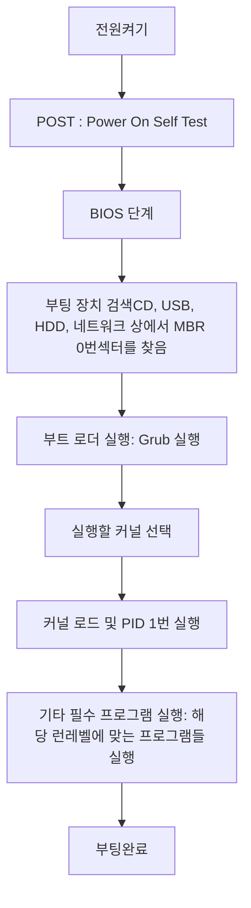

### 리눅스 부팅 순서

- POST(Power On Selft Test) : BIOS가 컴퓨터 주변장치를 검사하는 과정
- 부트 로더 : 시스템을 초기화하고 운영체제를 메모리에 로드
- Grub(Grnad Unified Bootloader) : 멀티부트로더


### 런레벨
시스템의 상태를 나타내는 값(0~6)
※ centOS 버전7에서는 사용하지 않음
```
who -r 		# 런레벨 확인
init 0 		# 런레벨 설정
```
0 : 시스템 복구 모드, 관리자 셀을 얻음
3 : 텍스트모드, 다중 사용자모드
5 : 그래픽 모드, 다중 사용자모드
6 : 재부팅

* /boot/grub2/grub.cfg : 버전이나 멀티 부팅할때 설정파일

### systemd
부팅관련 프로세스
1. 해당 런레벨에 맞는 프로세스를 실행
2. 서비스 관리(데몬의 시작 및 종료 등.(서버))
3. 소켓 관리, 장치 관리, 마운트 포인트 관리, 자동 마운트 포인트 관리 등..

```
sytemctl [옵션] [명령] [유닛이름]

# 부팅 런레벨 변경
systemctl get-default

systemctl set-default [multi-user.target|graphical.target]

# runlevel3 : multi-user.target
# runlevel5 : graphical.target
```
<br/> <br/>


----------------------------
참고자료 : [따라하면서 배우는 IT](https://www.youtube.com/watch?v=6f5lmOSfdsE&list=PL0d8NnikouEXVn9FfoX2XVlGgEArLDiLZ&index=44)
